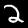
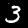
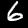
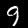
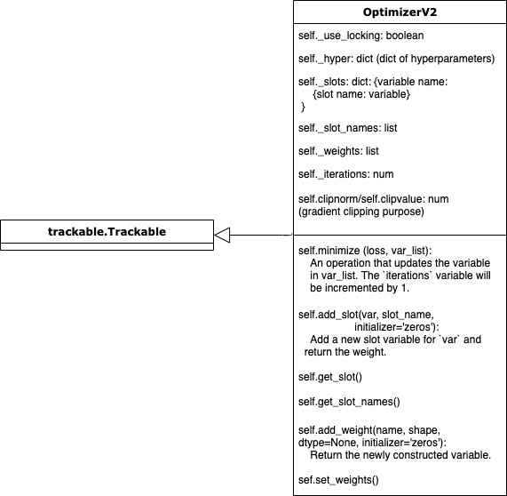

# ML
❤️ TensorFlow

## MNIST Digit Classification

    
    
    
    
    
    
    
    
    
    

(jpg files from: https://www.kaggle.com/scolianni/mnistasjpg)

## TensorFlow 2.x Optimizer V2 Architecture
(Main variables and methods)

